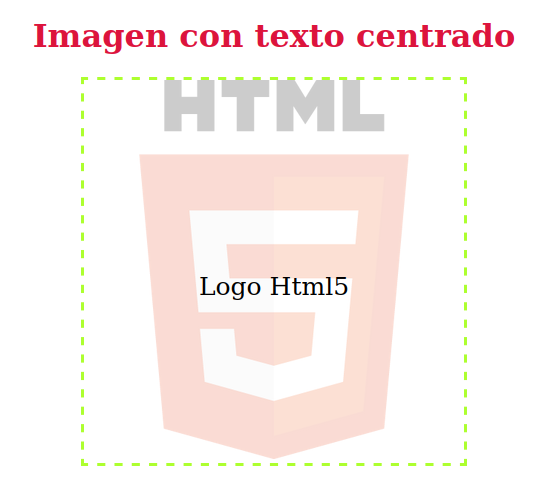
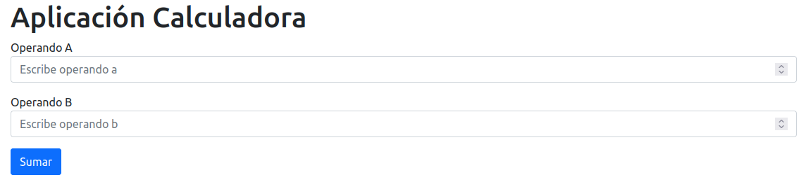
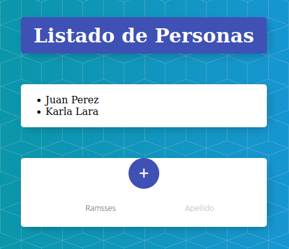
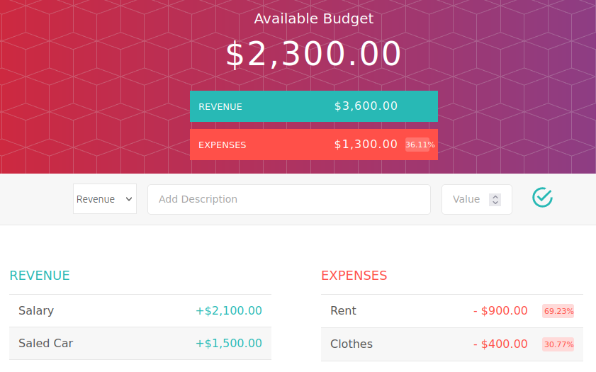
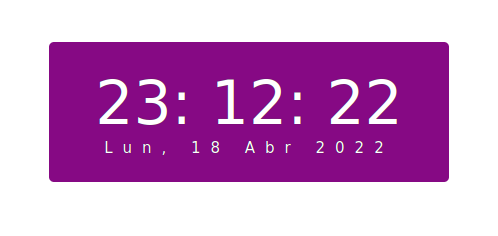

# Udemy-FrontEnd-Course

Excercises from Udemy course FrontEnd Web Developer

## Technologies We used

+ HTML
+ CSS
+ JS

## HTML Images Examples

### -- Login Form -- ==> ./html/LoginForm

## CSS Images Examples

### -- Image Center Text -- ==> ./css/ImgCenterText

## JS Images Examples

### -- Calculator -- ==> ./html-css-js/Calculadora

### -- Person List -- ==> ./html-css-js/ListadoPersonas

### -- Budget Application -- ==> ./html-css-js/Presupuesto

### -- Digital Watch -- ==> ./html-css-js/RelojDigital

